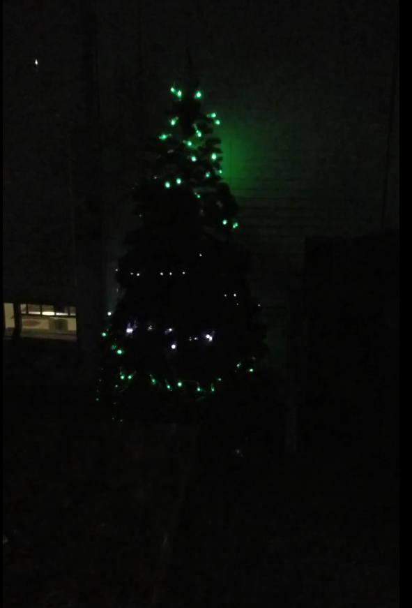

# Christmas Tree LED Reactive

This project involves:
* An Arduino
* WS2811 RGB LED Pixels
* Potentiometer
* Sound Detector
* Jumper Wires
* 25 µF Capacitor
* Toggle Switch or Slide Switch





## Description

I had wanted to create this project for a while but I didn't have the time or the space. 
With the use of an Arduino, the color of the LEDs would turn on when the sound sensor picked up on noise. 
Depending one what frequecies were picked up a cetain part of the tree lit up. It was split into tiers. 
The first tier would pick up on the rartist singing the lyrics, the second ties would react when lighter beats played. 
The third tier would light up with heavier beats.

[comment]: <> (## Getting Started)

[comment]: <> (### Dependencies)

[comment]: <> (* Describe any prerequisites, libraries, OS version, etc., needed before installing program.)

[comment]: <> (* ex. Windows 10)

[comment]: <> (### Installing)

[comment]: <> (* How/where to download your program)

[comment]: <> (* Any modifications needed to be made to files/folders)

[comment]: <> (### Executing program)

[comment]: <> (* How to run the program)

[comment]: <> (* Step-by-step bullets)

[comment]: <> (```)

[comment]: <> (code blocks for commands)

[comment]: <> (```)

## Authors

Camille Owens

[comment]: <> (## Version History)

[comment]: <> (* 0.2)

[comment]: <> (    * Various bug fixes and optimizations)

[comment]: <> (    * See [commit change]&#40;&#41; or See [release history]&#40;&#41;)

[comment]: <> (* 0.1)

[comment]: <> (    * Initial Release)

## Sources

[comment]: <> (Inspiration, code snippets, etc.)
* [sparkfun](https://www.sparkfun.com/)

